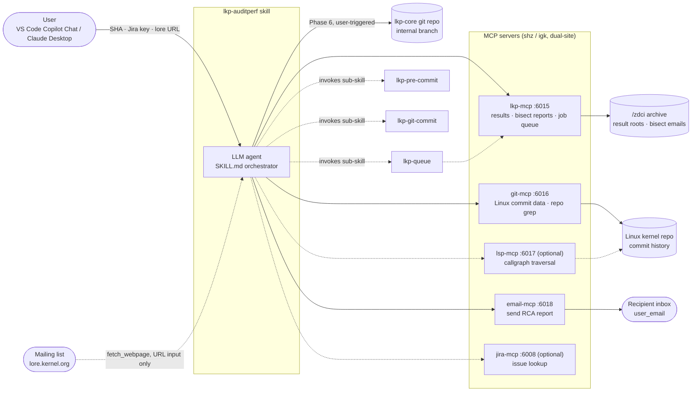
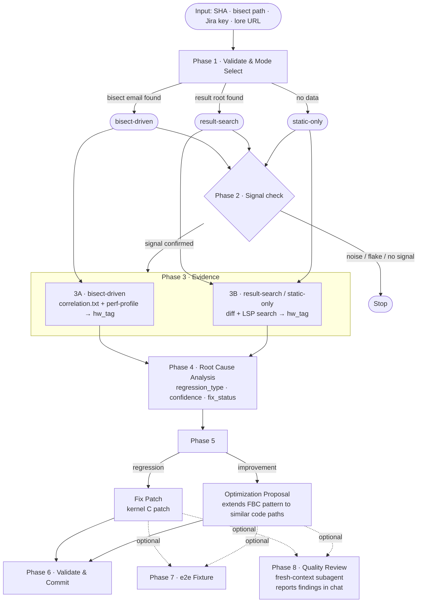
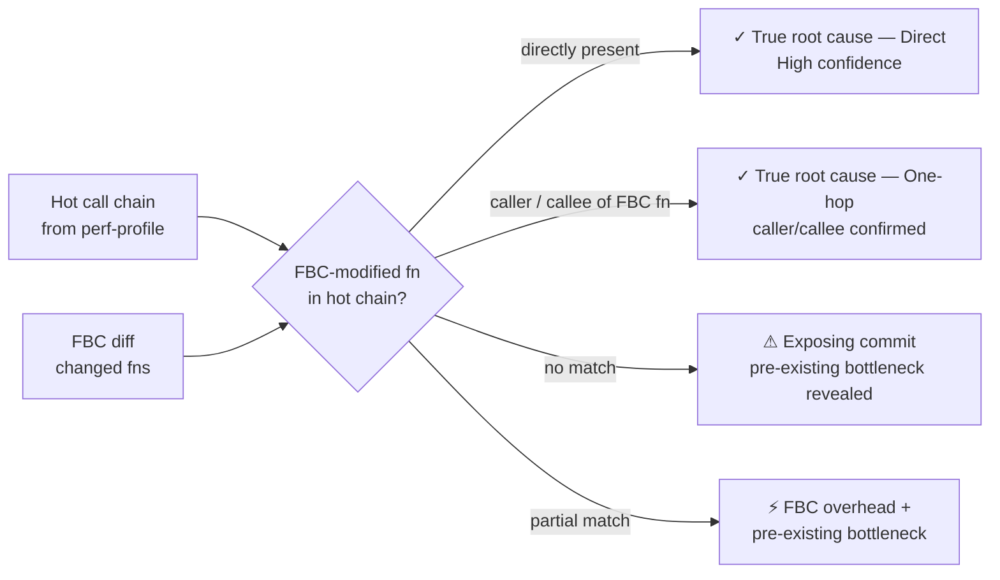
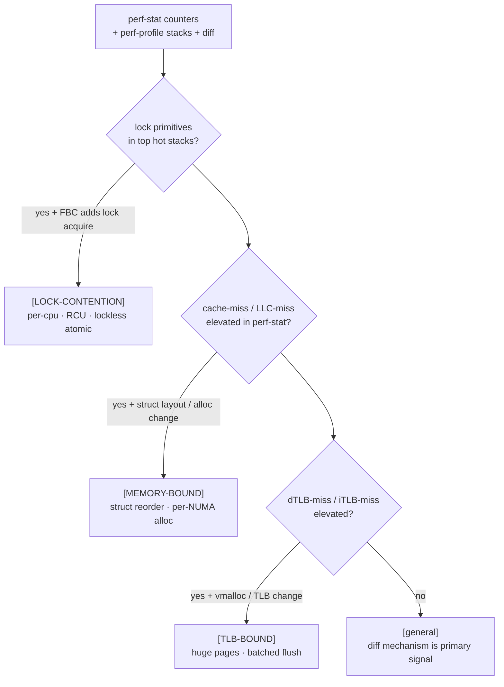
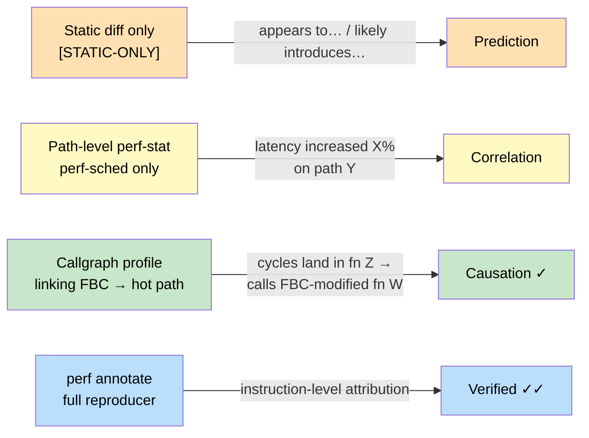
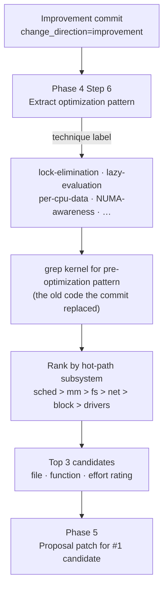

# lkp-auditperf — Performance Impact Analysis Methodology

Execution instructions for the LLM are in [SKILL.md](SKILL.md). This document explains the
**analytical reasoning chain** — how raw performance data becomes a root-cause conclusion and a
fix patch.

## Purpose

The goal of this skill is **not** "prove the bisect report is right." The goal is to determine
a kernel commit's **actual performance impact**, and then either fix a regression or extend an
improvement to other code paths (§7 Optimization Discovery). A validated bisect report — when
one exists — is one of three possible *inputs* to that analysis (`[BISECT-REPORT]` /
`[RESULT-FOUND]` / `[STATIC-ONLY]`, see §1), not the object being analyzed. Two-thirds of the
modes (`result-search`, `static-only`) run with no bisect report at all.

When a bisect report **is** supplied, the pipeline does not simply adopt its verdict. Phase 3
Step 0 commits to a `static_prediction` — an independent mechanism judgment from the diff alone
— *before* reading the bisect's perf-stat/perf-profile data, specifically so the two can be
compared rather than one being assumed from the other (§6 Fact / Inference Separation). Phase 4's
`## Verdict` **True root cause** row is the resulting answer to *"is the bisect report's causal
attribution correct?"* — `Yes` confirms it, `No` means the bisect correctly identified the
commit that triggered the symptom but the mechanism is a pre-existing bottleneck the commit only
exposed (an "exposing commit," not the true root cause). Either outcome is a valid, useful
result of the audit — the bisect report supplies leverage (which single commit to investigate),
not a conclusion.

## Table of Contents

- [Purpose](#purpose)
- [Setup](#setup)
  - [Required MCP servers](#required-mcp-servers)
  - [VS Code](#vs-code)
  - [Claude desktop](#claude-desktop)
  - [Specifying the report recipient (`mail_to`)](#specifying-the-report-recipient-mail_to)
  - [Sub-skills invoked automatically](#sub-skills-invoked-automatically)
- [Architecture](#architecture)
  - [System Context](#system-context)
  - [Component Structure](#component-structure)
- [Pipeline at a glance](#pipeline-at-a-glance)
- [1. Data Gathering](#1-data-gathering)
- [2. Commit Analysis](#2-commit-analysis)
- [3. Profile-Diff Overlap](#3-profile-diff-overlap)
- [4. Tag Classification](#4-tag-classification)
- [5. Regression Pattern → Fix Strategy](#5-regression-pattern--fix-strategy)
- [6. Fact / Inference Separation](#6-fact--inference-separation)
- [7. Optimization Discovery (improvements)](#7-optimization-discovery-improvements)
- [8. Email Section → Reader Question](#8-email-section--reader-question)
- [9. Post-audit Quality Review (Phase 8)](#9-post-audit-quality-review-phase-8)
- [10. Skill Improvement Workflow](#10-skill-improvement-workflow)

## Setup

### Required MCP servers

All server URLs use `lkp_server` from `llm/config.yml` (`0day.sh.intel.com` for `shz`,
`igk-lkp-server01.igk.intel.com` for `igk`):

| MCP server key | Port | Used for |
|---|---|---|
| `shz-lkp-mcp` / `igk-lkp-mcp` | `:6015` | Result files, bisect reports, test stats, job queueing |
| `shz-git-mcp` / `igk-git-mcp` | `:6016` | Linux commit data, repo file reads, grep |
| `shz-email-mcp` / `igk-email-mcp` | `:6018` | Sending RCA report + patch email (Phase 5) |
| `shz-lsp-mcp` / `igk-lsp-mcp` | `:6017` | Call-graph traversal for multi-file diffs *(optional)* |
| `shz-jira-mcp` | `:6008` | Fetching issue description when input is a Jira key *(optional)* |

Minimum required: **`lkp_mcp`** + **`git_mcp`**. Without `email_mcp` the patch email is printed to chat instead of sent.

### VS Code

Add to `.vscode/mcp.json` (workspace) or user-level `mcp.json`:
```json
{
  "servers": {
    "shz-lkp-mcp":   { "type": "sse", "url": "http://0day.sh.intel.com:6015/sse" },
    "igk-lkp-mcp":   { "type": "sse", "url": "http://igk-lkp-server01.igk.intel.com:6015/sse" },
    "shz-git-mcp":   { "type": "sse", "url": "http://0day.sh.intel.com:6016/sse" },
    "igk-git-mcp":   { "type": "sse", "url": "http://igk-lkp-server01.igk.intel.com:6016/sse" },
    "shz-email-mcp": { "type": "sse", "url": "http://0day.sh.intel.com:6018/sse" },
    "igk-email-mcp": { "type": "sse", "url": "http://igk-lkp-server01.igk.intel.com:6018/sse" }
  }
}
```
Invoke via Copilot Chat:
```
/lkp.auditperf 96d1610e0b
/lkp.auditperf ZDAYCI-20721 email me at you@example.com
/lkp.auditperf https://lore.kernel.org/oe-lkp/202506...
```

### Claude desktop

Add to `~/.config/Claude/claude_desktop_config.json` (Linux) or
`~/Library/Application Support/Claude/claude_desktop_config.json` (macOS):
```json
{
  "mcpServers": {
    "shz-lkp-mcp":   { "type": "sse", "url": "http://0day.sh.intel.com:6015/sse" },
    "igk-lkp-mcp":   { "type": "sse", "url": "http://igk-lkp-server01.igk.intel.com:6015/sse" },
    "shz-git-mcp":   { "type": "sse", "url": "http://0day.sh.intel.com:6016/sse" },
    "igk-git-mcp":   { "type": "sse", "url": "http://igk-lkp-server01.igk.intel.com:6016/sse" },
    "shz-email-mcp": { "type": "sse", "url": "http://0day.sh.intel.com:6018/sse" },
    "igk-email-mcp": { "type": "sse", "url": "http://igk-lkp-server01.igk.intel.com:6018/sse" },
    "shz-lsp-mcp":   { "type": "sse", "url": "http://0day.sh.intel.com:6017/sse" },
    "igk-lsp-mcp":   { "type": "sse", "url": "http://igk-lkp-server01.igk.intel.com:6017/sse" },
    "shz-jira-mcp":  { "type": "sse", "url": "http://0day.sh.intel.com:6008/sse" }
  }
}
```
Then add these files to your Claude Project as project knowledge:
- `SKILL.md` and all files under `references/` in this directory
- Sub-skill files: `.agents/skills/lkp-pre-commit/SKILL.md`,
  `.agents/skills/lkp-queue/SKILL.md`, `.agents/skills/lkp-git-commit/SKILL.md`

### Specifying the report recipient (`mail_to`)

`user_email` is resolved in priority order:

1. **Inline in the prompt**: `/lkp.auditperf 96d1610e0b email me at you@example.com`
2. **`git config user.email`** on the workspace host — verify with: `git config user.email`
3. **Agent asks** — if both are empty the agent pauses; reply with an address or `"skip"`

### Sub-skills invoked automatically

| Phase | Sub-skill | Purpose |
|-------|-----------|----------|
| 3C *(optional)* | `lkp-queue` | Queue test jobs when no result data exists yet |
| 5 | `lkp-pre-commit` | Lint and validate the generated patch |
| 6 | `lkp-git-commit` | Commit the fix or optimization proposal |
| 8 *(user-triggered)* | fresh-context subagent | Fresh-context quality review of the completed audit |

## Architecture

The diagrams above (§Pipeline at a glance and the per-phase decision trees below) show *runtime
logic* — what the agent decides at each step. The two diagrams here show *structure* instead: the
systems this skill talks to, and how its own files are organized.

### System Context

What the skill reads from, writes to, and is invoked by. All external systems are reached
exclusively through the MCP servers listed in [Setup](#required-mcp-servers) — the skill itself
holds no direct network credentials.



Dashed edges are optional/conditional paths (only taken in specific modes or on request); solid
edges run on every invocation.

### Component Structure

How the skill's own files are organized. `SKILL.md` is the only entry point — it never contains
phase logic itself, only the rules, session-state contract, and a dispatch table pointing at one
`references/phase*.md` file per phase. Scripts encapsulate the mechanical (non-judgment) steps
within a phase so the LLM classifies/tallies nothing by hand.

```mermaid
flowchart TD
    SKILL["SKILL.md\nrules · session state · phase dispatch table"]

    SKILL --> P1["phase1-validate.md"]
    P1 -.->|URL input only| P1U["phase1-url-branch.md"]
    SKILL --> P2["phase2-signal.md"]
    SKILL --> P3A["phase3-evidence.md\n(bisect-driven)"]
    SKILL --> P3B["phase3-commit-only.md\n(result-search / static-only)"]
    SKILL --> P4["phase4-rca.md"]
    P4 -.->|improvement| P4O["phase4-optimization.md"]
    SKILL --> P5["phase5-patch.md"]
    SKILL --> P6["phase6-commit.md"]
    SKILL --> P7["phase7-e2e.md"]
    SKILL --> P8["phase8-review.md"]

    P4 --> DomainRef["domain-reference.md\n+ references/domain/**\n(suites · subsystems · platforms · metrics)"]
    P4 --> RegPat["regression-patterns.md\n8 named patterns"]
    P1 & P2 & P3A & P3B & P4 -.->|on any MCP failure| Fallback["mcp-fallback.md\nSSH drop-in catalog"]

    P1 --> S_resolve["scripts/resolve-bisect-email"]
    P2 --> S_signal["scripts/classify-signal-confidence"]
    P2 & P4 --> S_conf["scripts/apply-confidence-modifiers"]
    P3A --> S_metric["scripts/classify-metric-tag"]
    P3A --> S_chain["scripts/check-chain-completeness"]
    P4 --> S_cov["scripts/check-coverage-gate"]
    P5 --> S_lint["scripts/lint-email-body"]

    P3B -.->|no result data| SubQueue(["lkp-queue\n(sub-skill)"])
    P5 --> SubLint(["lkp-pre-commit\n(sub-skill)"])
    P6 --> SubCommit(["lkp-git-commit\n(sub-skill)"])
    P8 --> SubReview(["fresh-context subagent"])
```



---

## Pipeline at a glance



---

## 1. Data Gathering

Three evidence tiers are possible depending on what infrastructure data exists:

| Tier | Tag | Data available |
|---|---|---|
| Full bisect | `[BISECT-REPORT]` | Validated bisect email + perf-stat + perf-profile + `correlation.txt` |
| Result search | `[RESULT-FOUND]` | Result root found; no bisect validation |
| Diff only | `[STATIC-ONLY]` | Unified diff + LLM kernel knowledge only |

### Regression signal — perf-stat

The primary regression signal is a measured metric delta between the FBC (first bad commit, `a`)
and the baseline (`b`):

```
# from compare file in result_root
perf_events.throughput%: mean_a=128456  mean_b=234567  perf_change=-45.2%
```

A `perf_change` of −45% across a single-commit bisect is the starting point; everything below
explains how the skill determines *why*.

### Coverage gate — correlation.txt

Before any RCA reasoning, the skill verifies the FBC was actually compiled into the kernel being
tested. A changed file must appear in `correlation.txt` with a `|- y` or `CC …` entry:

```
|- y kernel/sched/fair.c
|  |- CC kernel/sched/fair.o
|  `- LD vmlinux
```

If every changed file shows only `|- miss CONFIG_*` (not compiled), the FBC cannot be the root
cause and the analysis stops.

### Hot-path evidence — perf-profile

The perf call-graph profile records where CPU time was spent during the regression. Positive-delta
entries (functions that grew between `a` and `b`) are the primary signal:

```
# perf_profile_fbc.txt — top positive-delta entries
+28.45%  hackbench  [kernel.kallsyms]  [k] _raw_spin_lock
+15.23%  hackbench  [kernel.kallsyms]  [k] pick_next_task_fair
+ 8.91%  hackbench  [kernel.kallsyms]  [k] __enqueue_entity
```

The full call chain from each top entry (not just the leaf function) is the evidence used in the
profile-diff overlap.

---

## 2. Commit Analysis

The unified diff is read via `mcp_shz_git_mcp_get_linux_commit`. Three things are extracted immediately,
before any RCA reasoning:

1. **Mechanism** — what the commit changes in the codebase (factual; no performance inference yet)
2. **Key snippets** — the 2–3 lines most likely responsible for performance impact, quoted verbatim
3. **Path connection** — one sentence linking the changed code to the stressor's hot path
   (only stated if callgraph or LSP evidence confirms the link)

**Example** — a commit that adds a per-CPU counter under a spinlock:

```c
/* before */
atomic64_add(delta, &rq->nr_running_total);

/* after (FBC) */
raw_spin_lock(&rq->lock);
atomic64_add(delta, &rq->nr_running_total);
raw_spin_unlock(&rq->lock);
```

Mechanism: *"adds spinlock protection to the nr_running_total update in update_rq_clock()"*
Key snippet: `raw_spin_lock(&rq->lock)` in `kernel/sched/core.c:update_rq_clock()`

---

## 3. Profile-Diff Overlap

The most important single question in the analysis:

> Does the FBC-modified code appear on the hot call chain recorded during the regression?



**Example** — continuing from above:

```
perf-profile hot chain:
  hackbench → futex_wait → wake_up_q → try_to_wake_up → update_rq_clock  ← FBC modified
                                                          ↑ raw_spin_lock added here
```

Overlap result: *Direct* — `update_rq_clock` is both in the hot chain and in the FBC diff.

---

## 4. Tag Classification

The hardware counter data from perf-stat, combined with the diff mechanism, narrows the regression
to one of three performance classes:



### `[LOCK-CONTENTION]`

**Evidence pattern:**
- Top perf-profile stacks dominated by lock primitives (`_raw_spin_lock`, `mutex_lock`,
  `down_read`, `osq_lock`)
- FBC modifies a lock-protected path or adds a new lock acquire
- High CPU/thread count amplifies the contention

**Classification-supporting fact** (required in the report): CPU count and socket count — without
this, a reader cannot judge whether contention scaling at this thread count is plausible.

**Typical fix approach:** per-CPU data structure, RCU read-side, lockless atomic, or reduced lock
scope (move acquire closer to the write).

### `[MEMORY-BOUND]`

**Evidence pattern:**
- perf-stat shows elevated `cache-misses`, `LLC-load-misses`, or PEBS memory-load stalls
- FBC adds struct fields, changes struct layout, or alters allocation sites
- Working set likely exceeds per-node memory

**Classification-supporting fact** (required in the report): NUMA node count and memory-per-node
— reader needs this to judge whether locality sensitivity is credible.

**Typical fix approach:** struct field reorder (hot fields first, cold fields last), per-NUMA-node
allocation, false-sharing elimination via `____cacheline_aligned`.

### `[TLB-BOUND]`

**Evidence pattern:**
- perf-stat shows elevated `dTLB-load-misses`, `iTLB-load-misses`, or `page-faults`
- FBC adds `vmalloc`/`vmap` calls, changes huge-page usage, or increases TLB shootdown frequency

**Classification-supporting fact** (required in the report): CPU microarchitecture — TLB flush
costs differ significantly by generation (e.g. Haswell vs Sapphire Rapids).

**Typical fix approach:** huge-page usage, batched TLB flush, reduced vmalloc in hot paths.

### `general`

Used when hardware counter data is absent or does not match any of the above patterns. The fix
strategy is derived from the diff mechanism alone.

---

## 5. Regression Pattern → Fix Strategy

[regression-patterns.md](references/regression-patterns.md) contains 8 named patterns with
fix-approach tables. The `hw_tag` from Phase 3 narrows the pattern candidates:

| hw_tag | Likely patterns to check |
|---|---|
| `[LOCK-CONTENTION]` | Lock granularity, False sharing, Thundering herd |
| `[MEMORY-BOUND]` | Struct layout, NUMA imbalance, Cache thrashing |
| `[TLB-BOUND]` | TLB shootdown, Huge-page regression |
| `none` | All 8 patterns; diff mechanism is the primary signal |

The regression pattern determines the fix technique. The fix patch generated in Phase 5 must
address the pattern, not just revert the commit — reverting security or functional fixes is never
a valid approach.

---

## 6. Fact / Inference Separation

The report emitted in Phase 4 enforces a strict distinction between measured facts and inferences.
The evidence tier determines the strongest permitted claim language:



Causation language (`"caused by"`, `"the regression is"`) is prohibited without a traced callgraph
chain. The `## Causal Chain` section always states the evidence tier explicitly so the reader
knows which claims are measured and which are inferred.

---

## 7. Optimization Discovery (improvements)

When the input report carries `change_direction: improvement`, the pipeline runs the same
evidence-gathering and commit-analysis steps, but Phase 4 pivots at Step 6:



Phase 5 generates an **Optimization Proposal** patch labeled
`[OPTIMIZATION PROPOSAL — extends {fbc_hash[:10]} pattern]`, rather than a regression fix.

---

## 8. Email Section → Reader Question

The email section order maps directly to the reader's sequential questions.
Reordering breaks the reading flow.

| Section | Reader's question | Why this position |
|---|---|---|
| `## Summary` | "What happened in one sentence?" | Conclusion first — reader can stop here if they trust the confidence |
| `## Verdict` | "How confident? What data?" | Trust signal before any detail |
| `## Impact Mechanism` | "How did the commit affect the benchmark?" | Grounds the reader in test context before the kernel path |
| `## Causal Chain` | "Show me the exact kernel path" | Mechanism theory — the directed graph |
| `## Evidence` | "Prove it — raw counters and facts" | Proof immediately follows theory |
| `## Prediction vs Measurement` | "Was the static analysis right?" | Closes the falsification loop |
| `## Community Awareness` | "Is this already fixed?" | Action-relevance check before proposing more work |
| `## Optimization Opportunities` | "Where else does this pattern apply?" | Reader has full mechanism context to evaluate candidates |
| `## Optimization Proposal` | "Here's the concrete patch" | Actionable output last |
| `## Analysis Metrics` | "How long did this take?" | Housekeeping footer |

---

## 9. Post-audit Quality Review (Phase 8)

Trigger: say `review` after Phase 5 completes (independently of, and in any order relative to,
`validate` for Phase 6 and `e2e` for Phase 7 — all three are offered together in one consolidated
message at the end of Phase 4's post-analysis domain update, never split across separate turns).

Phase 8 spawns a **fresh-context subagent**. The subagent receives only
the saved `rca_email_body` (the finished email) and a self-contained evaluation rubric.
It has no knowledge of the Phase 1–5 reasoning chain, so it evaluates the output as an
external reviewer would.

The four evaluation criteria:

| Criterion | What it checks | Rating scale |
|---|---|---|
| **Evidence chain** | All four links cited with data: metric → profile entry → callgraph/LSP → FBC-changed function | Complete / Partial / Gap-heavy |
| **Alternative hypotheses** | ≥2 patterns named from `regression-patterns.md` with data-backed exclusions | Pass / Partial / Fail |
| **Prediction calibration** | `static_prediction` vs measured outcome (bisect-driven/result-search only) | AGREES / PARTIAL / CONTRADICTS |
| **Skill improvement candidates** | New domain facts, missing entries, instruction ambiguities visible from output | `[DATA-GAP]` / `[STRUCTURAL]` entries |

Findings are reported in chat — **not** back into the email (already sent). `[BUG]` /
`[DATA-GAP]` / `[STRUCTURAL]` entries all trigger the same immediate-fix offer: auditperf
applies the fix itself, once the user confirms, and commits it.

See [references/phase8-review.md](references/phase8-review.md) for full execution rules.

---

## 10. Skill Improvement Workflow

Each analysis run produces a **domain knowledge update** (Phase 4 Step 5, always runs) and
optionally a **post-audit quality review** (Phase 8, user-triggered). Improvement candidates
from both steps are handled in three tiers:

| Type | Criterion | Action |
|---|---|---|
| **Bug** | Skill instruction is factually wrong and caused this run to fail or produce incorrect output | Fix immediately — edit the reference file and commit it before continuing |
| **Data gap** | A domain/reference file is missing an entry needed for the analysis (suite syscall, regression pattern, hot-function list) | Write directly to domain files and commit |
| **Structural improvement** | An instruction is ambiguous but did not block the analysis | Report in chat, then fix directly (with user confirmation) in the same session — same immediate-fix flow as Bug/Data gap |

All three types are fixed directly by auditperf itself once the user confirms — no separate
agent invocation is required.
